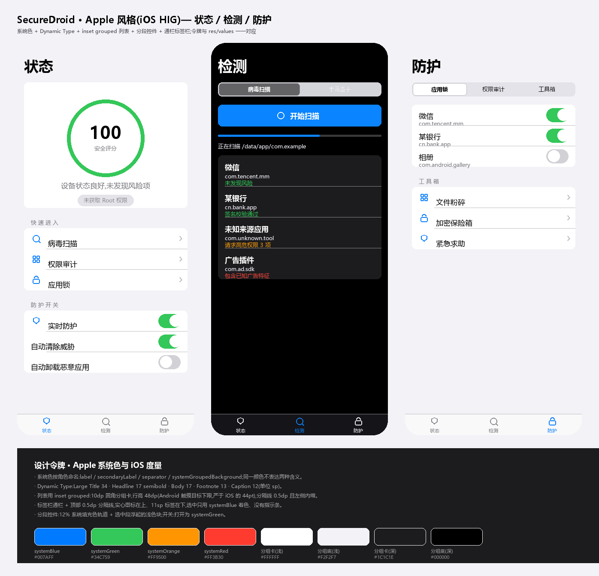

# SecureDroid 设计系统 · Apple 风格(iOS Human Interface Guidelines)

> 上图由 `design/render_mockup.py` 按本文件的令牌 1:1 渲染生成,**不是真机截图**。
> 令牌改动后重跑脚本即可看到界面随之变化(色值需与 `res/values*/colors.xml` 手工同步)。

## 一、信息架构:三大板块

| 板块 | 二级功能(板内 iOS 分段控件) |
| --- | --- |
| **状态** | 评分环 + 快速入口 + 防护开关 |
| **检测** | 病毒扫描 · 木马查杀 |
| **防护** | 应用锁 · 权限审计 · 工具箱 |

## 二、设计依据

HIG 与 UI/UX Pro Max 的取舍不同,**冲突时以更严的一方为准**(说明写在每条规则后面):

| 来源 | 采纳的规则 | 与 Android 规范的冲突如何裁决 |
| --- | --- | --- |
| **Apple HIG · Color** | 用**语义化系统色**(label / secondaryLabel / separator / systemGroupedBackground…),不按外观硬编码;同一颜色不表达两种含义 | 系统色直接照搬 iOS 的 light/dark 数值 |
| **Apple HIG · Typography** | 使用 Dynamic Type 的命名尺度:Large Title 34 · Title 17 semibold · Body 17 · Footnote 13 · Caption 12 | 单位换成 sp,随系统字体缩放 |
| **Apple HIG · Lists and tables** | inset grouped:10dp 圆角分组卡,行内不画卡片;分隔线只画在行与行之间 | 行高取 **48dp**(Android 触摸目标下限)而不是 iOS 的 44pt —— 取更严的一方 |
| **Apple HIG · Tab bars** | 顶层导航用标签栏;图标优先用**实心符号**;必须有文字标签;不要禁用/隐藏标签 | 3 个标签,无指示条,选中只用 systemBlue 着色 |
| **Apple HIG · Segmented controls** | 段数 ≤5,段宽一致,同层只用文字或只用图标 | 2–3 段,纯文字 |
| **Apple HIG · Materials** | 玻璃只用于功能层;内容层用可读的不透明表面 | 标签栏是唯一的半透明元素 |
| **UI/UX Pro Max** | 触摸目标 ≥48dp、相邻间距 ≥8dp、正文对比度 ≥4.5:1、不用 emoji 当图标、状态不靠颜色单独表意 | 与 HIG 一致,直接叠加 |

> **没有照搬的**:iOS 的返回手势、导航栏胶囊按钮、Dynamic Island —— 这些依赖 iOS 系统行为,
> 在 Android 上硬造只会得到一个"不像 iOS 也不像 Android"的界面。这里翻译的是**原则**,不是外形。

## 三、令牌

### 1. 系统色(浅色 / 深色)

| 角色 | 浅色 | 深色 |
| --- | --- | --- |
| systemBlue(主行动、可点文本、选中态) | `#007AFF` | `#0A84FF` |
| systemGreen(安全 / 开关打开) | `#34C759` | `#30D158` |
| systemOrange(警示) | `#FF9500` | `#FF9F0A` |
| systemRed(危险) | `#FF3B30` | `#FF453A` |
| label / secondaryLabel / tertiaryLabel | `#000000` / 60% / 30% | `#FFFFFF` / 60% / 30% |
| separator | `#3C3C4349` | `#545458A6` |
| systemGroupedBackground(页面底) | `#F2F2F7` | `#000000` |
| secondarySystemGroupedBackground(分组卡) | `#FFFFFF` | `#1C1C1E` |
| systemFill(胶囊底 / 分段轨道) | `#7676801F` | `#7676803D` |
| 分段控件选中块 | `#FFFFFF` | `#636366` |

旧令牌名(`sd_brand` / `sd_text` / `status_*` …)保留为别名,映射到上表的角色,避免推翻既有布局。

### 2. 字体(Dynamic Type,Large 档)

| 样式 | 字号 | 用途 |
| --- | --- | --- |
| Large Title | 34sp bold | 页面标题 |
| Display | 40sp bold | 评分数字 |
| Headline | 17sp bold | 列表行标题 |
| Body | 17sp / 行高 +5dp | 正文、行文本 |
| Footnote | 13sp | 分组标题(大写)、辅助说明 |
| Caption | 11sp | 标签栏文字 |

### 3. 度量

- 屏幕边距 **16dp**(iOS grouped list 标准);分组卡圆角 **10dp**;
- 行高 **48dp**;标签栏 **50dp**;分段控件可点高度 **44dp**;
- 分隔线 **0.5dp**,左侧内缩 52dp(有图标)/ 16dp(无图标),与文字对齐;
- 主按钮 50dp 高、10dp 圆角、systemBlue 底 + 17sp semibold 白字。

### 4. 动效

列表项入场沿用轻微淡入位移(280–320ms 缓出),按压缩放动画已**移除** ——
iOS 的按压反馈是"高亮变暗",不是缩放。所有动效受系统动画时长缩放控制。

## 四、实现落点

| 规范 | 实现 |
| --- | --- |
| 分组列表 | `fragment_*.xml` 用 `Widget.SecureDroid.Card`(10dp 圆角)+ 行布局;分隔线由 `ui/InsetDividerDecoration` 绘制,只画在行与行之间 |
| 行 | `item_*.xml`:MinHeight 48dp,无卡片,靠外层分组卡收纳 |
| 披露指示符 | `drawable/ic_chevron.xml`,装饰性元素(`importantForAccessibility="no"`) |
| 分段控件 | `bg_segment_track`(轨道)+ `color/seg_bg`(选中块)+ `Widget.SecureDroid.Segment` |
| 开关 | `color/switch_track`(打开 = systemGreen)+ `color/switch_thumb` |
| 标签栏 | `drawable/bg_tabbar.xml`(通栏 + 顶部 0.5dp 线)+ `color/tab_text.xml` + 实心图标 `ic_tab_*` |
| 评分环 | Material `CircularProgressIndicator` 定值模式,环 = 分值,颜色随状态切换 |

## 五、自检清单(HIG + UI/UX Pro Max)

- [x] 触摸目标 ≥48dp(行、按钮、开关、分段)
- [x] 正文对比度 ≥4.5:1(浅色 label #000000 / 白卡;深色 #FFFFFF / #1C1C1E)
- [x] 颜色不单独表意(评分环配状态文案;结果行既有状态词也有颜色)
- [x] 深/浅两套系统色独立定义,由 `NightThemeTokenTest` 校验覆盖与差异
- [x] 图标:内容区线性(2dp 描边)、标签栏实心,两套层级分明且各自统一
- [x] 标签栏 3 项、有文字标签、不存在禁用/隐藏项
- [x] 分段控件段数 ≤5、纯文字、等宽
- [x] 装饰性图标不进入无障碍树(`importantForAccessibility="no"`)
- [ ] 真机 / 模拟器视觉验证 —— 环境无可用设备(设计稿为令牌渲染,非截图)
- [ ] Dynamic Type 极端字号下的布局回归 —— 尚未在真机验证

## 六、重新生成设计稿

    python design/render_mockup.py     # 输出 design/mockup-sheet.png
